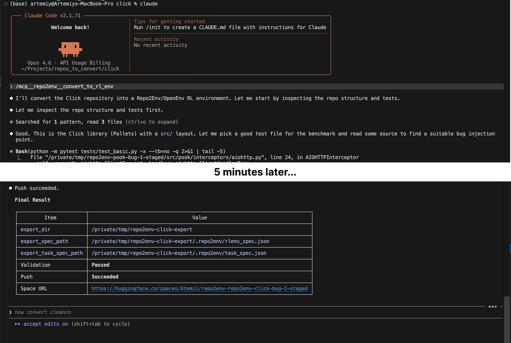

# Repository-to-RLenv

Repository-to-RLenv turns a Python repo into a live RL coding environment.



## Install

```bash
pip install -e .
```

If you use Claude Code, register the MCP server:

```bash
claude mcp add --scope user repo2env -- .venv/bin/repo2env-mcp
```

## Use

Open the target repo in Claude Code and run:

```text
/mcp__repo2env__convert_to_rl_env
```

**One command kicks off the full conversion workflow.**

<details>
<summary>Inference</summary>
You can also run Repo2Env locally:

```bash
repo2env-openenv-server --port 8000
```

Smoke test a local or HF-hosted env:

```bash
repo2env-smoke-test --base-url http://127.0.0.1:8000
```

Run inference against an env:
```
repo2env-infer \
  --base-url https://tema7707-repo2env-toolz.hf.space \
  --model gpt-4o-mini \
  --model gpt-5 \
  --temperature 1 \
  --output toolz_infer_debug.json
```
</details>

## How It Works

Current one-command MCP workflow:

```text
start Claude Code
  ->
run /mcp__repo2env__convert_to_rl_env
  ->
AUTOMATIC: inspect repo structure and tests
  ->
AUTOMATIC: copy repo to /tmp/repo2env-<repo>-bug-<variant>-staged
  ->
AUTOMATIC: Claude introduces one small source-code bug in the staged copy
  ->
AUTOMATIC: rerun scoped tests to confirm the bug actually fails
  ->
AUTOMATIC: write task_spec.json on the staged copy
  ->
AUTOMATIC: Repo2Env analyze_repo on staged copy
  ->
AUTOMATIC: Repo2Env convert_repo on staged copy
  ->
AUTOMATIC: openenv validate
  ->
AUTOMATIC: openenv push
  ->
HF Space with live RL env
```

## Live Collection

- [Repository to RLEnv collection](https://huggingface.co/collections/tema7707/repository-to-rlenv)
- [tema7707 Spaces](https://huggingface.co/tema7707/spaces)

## Converted Envs

| Source repo | Stars | Hugging Face Space | Claude conversation |
|---|---:|---|---|
| [psf/requests](https://github.com/psf/requests) | 53,862 | [Atemii/repo2env-repo2env-requests-bug-1-staged](https://huggingface.co/spaces/Atemii/repo2env-repo2env-requests-bug-1-staged) | [requests.txt](conversations/requests.txt) |
| [pallets/click](https://github.com/pallets/click) | 17,343 | [Atemii/repo2env-repo2env-click-bug-1-staged](https://huggingface.co/spaces/Atemii/repo2env-repo2env-click-bug-1-staged) | [click.txt](conversations/click.txt) |
| [pytoolz/toolz](https://github.com/pytoolz/toolz) | 5,120 | [tema7707/repo2env-toolz](https://huggingface.co/spaces/tema7707/repo2env-toolz) | — |
| [pytoolz/toolz](https://github.com/pytoolz/toolz) | 5,120 | [tema7707/repo2env-toolz-bug-0](https://huggingface.co/spaces/tema7707/repo2env-toolz-bug-0) | [toolz.txt](conversations/toolz.txt) |
| [more-itertools/more-itertools](https://github.com/more-itertools/more-itertools) | 4,041 | [tema7707/repo2env-repo2env-more-itertools-bug-intersperse-staged](https://huggingface.co/spaces/tema7707/repo2env-repo2env-more-itertools-bug-intersperse-staged) | [more-itertools.txt](conversations/more-itertools.txt) |
| [mahmoud/glom](https://github.com/mahmoud/glom) | 2,128 | [tema7707/repo2env-repo2env-glom-bug-mutation-staged](https://huggingface.co/spaces/tema7707/repo2env-repo2env-glom-bug-mutation-staged) | [glom.txt](conversations/glom.txt) |
| [pytest-dev/pluggy](https://github.com/pytest-dev/pluggy) | 1,581 | [Atemii/repo2env-repo2env-pluggy-bug-ordering-staged](https://huggingface.co/spaces/Atemii/repo2env-repo2env-pluggy-bug-ordering-staged) | [pluggy.txt](conversations/pluggy.txt) |
| [python-humanize/humanize](https://github.com/python-humanize/humanize) | 709 | [tema7707/repo2env-repo2env-humanize-bug-intword-staged](https://huggingface.co/spaces/tema7707/repo2env-repo2env-humanize-bug-intword-staged) | — |
| [h2non/pook](https://github.com/h2non/pook) | 368 | [tema7707/repo2env-pook](https://huggingface.co/spaces/tema7707/repo2env-pook) | — |
| [matsui528/nanopq](https://github.com/matsui528/nanopq) | 360 | [tema7707/repo2env-repo2env-nanopq-bug-decode-staged](https://huggingface.co/spaces/tema7707/repo2env-repo2env-nanopq-bug-decode-staged) | [nanopq.txt](conversations/nanopq.txt) |
| [psolin/cleanco](https://github.com/psolin/cleanco) | 351 | [tema7707/repo2env-repo2env-cleanco-bug-strip-tail-staged](https://huggingface.co/spaces/tema7707/repo2env-repo2env-cleanco-bug-strip-tail-staged) | [cleanco.txt](conversations/cleanco.txt) |
| [scrapinghub/number-parser](https://github.com/scrapinghub/number-parser) | 127 | [tema7707/repo2env-repo2env-number-parser-bug-1-staged](https://huggingface.co/spaces/tema7707/repo2env-repo2env-number-parser-bug-1-staged) | [number-parser.txt](conversations/number-parser.txt) |
